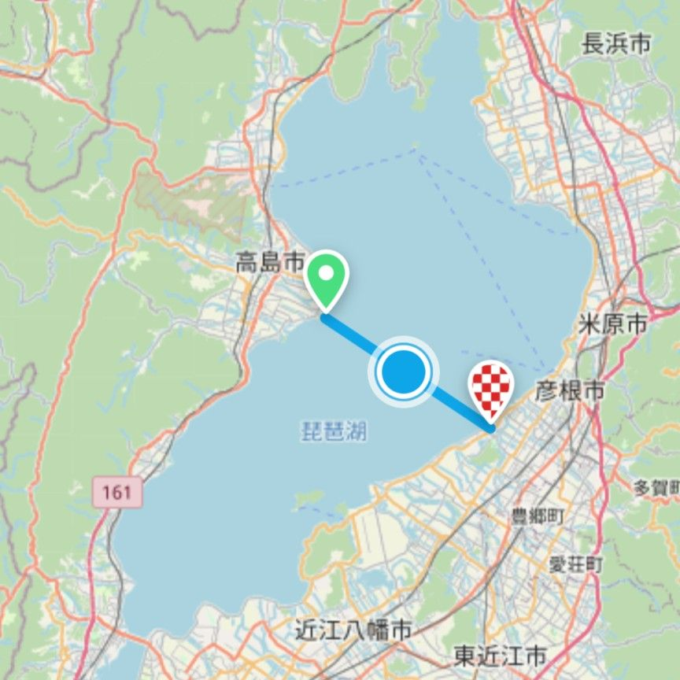
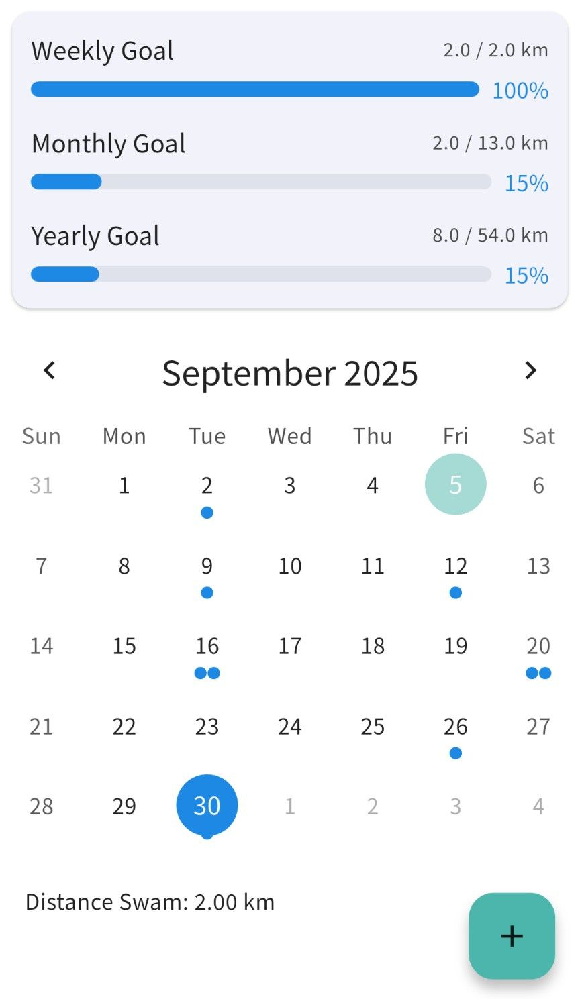
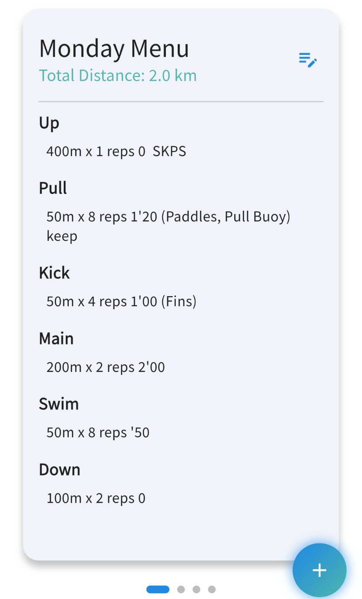

# Swimming Trip 🏊‍♂️🌊

"Swimming Trip" is a swimming log and training management app focused on motivation, turning your daily swimming practice into a "Trip."

## 🌟 Key Features

### 1. Map-Linked Progress Tracking (Swimming Trip)
Set your goal distance (Weekly, Monthly, or Yearly) and aim for destinations on the map.
- **Route Setting**: Select any start and end points on the map to create your original swimming route.
- **Trip Progress**: Your icon moves along the map according to the distance you've swum. Visualize your training results as a "travel distance."

### 2. Advanced Training Menu Management
Create, save, and manage professional-grade training menus.
- **Detailed Configuration**: Set strokes (Freestyle, Backstroke, Breaststroke, Butterfly, Individual Medley), intensity, sections (Warm-up, Kick, Pull, Drill, Main, etc.), and equipment (Fins, Paddles, etc.).
- **Automatic Calculations**:
  - **Total Distance**: Automatically calculates the total distance of the entire menu.
  - **Calorie Consumption**: Features an advanced calorie calculation engine combining METs, user weight, stroke type, and intensity.

### 3. Calendar & Statistics
- **Training Logs**: Manage your daily swimming distances via a calendar.
- **Goal Management**: Visualize your achievement rates for weekly, monthly, and yearly goals.
- **Statistical Graphs**: Analyze your past performance with insightful charts.

### 4. Multi-language Support (21 Languages)
Supports 21 languages, including Japanese, English, Spanish, French, and Chinese, so swimmers around the world can use it.

## 📸 Screenshots

| Map Screen | Calendar Screen | Menu Management |
| :---: | :---: | :---: |
|  |  |  |

## 🛠 Tech Stack

- **Framework**: [Flutter](https://flutter.dev/) (Dart)
- **State Management**: `StatefulWidget` & `SharedPreferences`
- **Maps**: [flutter_map](https://pub.dev/packages/flutter_map) (OpenStreetMap)
- **Localization**: [easy_localization](https://pub.dev/packages/easy_localization)
- **Charts**: [fl_chart](https://pub.dev/packages/fl_chart)
- **Animations**: [flutter_animate](https://pub.dev/packages/flutter_animate)
- **Database**: [shared_preferences](https://pub.dev/packages/shared_preferences) (Local storage)
- **Ads**: [google_mobile_ads](https://pub.dev/packages/google_mobile_ads)

## 🚀 Getting Started

### Install Dependencies
```bash
flutter pub get
```

### Run the App
```bash
flutter run
```

## 📝 Development Notes

### Asset Structure
- `assets/translations/`: JSON translation files for each language.
- `assets/images/`: Screenshots and icons.

### Calorie Calculation Logic
This app uses a unique algorithm within `lib/training_menu.dart`, calculating calories based on stroke-specific METs values, taking into account user weight and exercise intensity.

## 📄 License
This project is licensed under the [MIT License](LICENSE).
